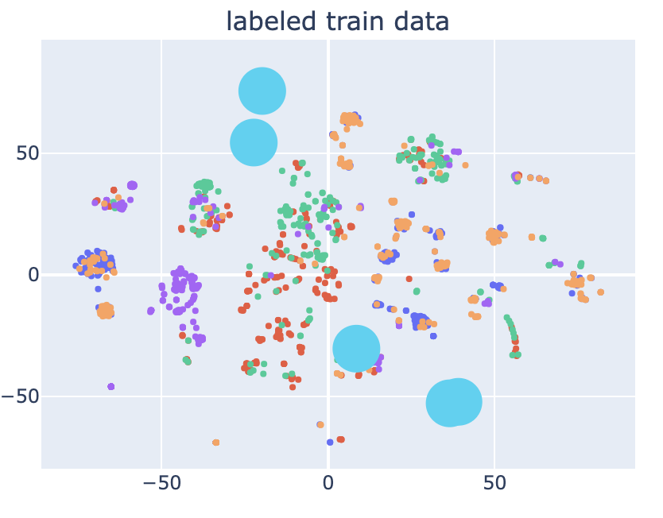
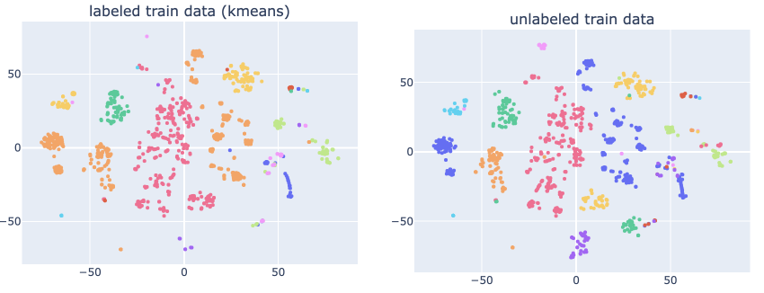

# MWSCUP 2023 1st Place Solution
​
​
## 特徴量エンジニアリング
​
- 基本はサンプルノートブックで抽出された特徴量を使用した。
​
- サンプルノートブックで抽出された2000個以上の特徴量のうち、LightGBMで重要度が高かった上位160個を使用した。
​
- それに加えて、jsonlに含まれる```ssdeep```、```imphash```、```impfuzzy```を使用して、特徴量を追加した。
​
    - ハッシュ値をコロン区切りで分け、全データ内で3回以上現れるハッシュ値を探した。そのうち、```tf```を除いたハッシュ値について、ハッシュ値が一致するかどうかを特徴量として追加した。さらに、```ssdeep```、```impfuzzy```の1つ目のコロンまでの値はそのまま特徴量として追加した。
​
- LighGBMで選択した160個の特徴量と、ハッシュ値が一致するかどうかを表す特徴量を合わせた特徴量を使用した。
​
### その他試した特徴量
​
- LightGBMで重要度が高かった上位160個の特徴量について、それぞれの特徴量の積を計算した(25600個)。その後、TSNE、UMAP、PCAを用いて80次元に圧縮した。
​
## モデル
​
- 基本的には、LightGBM、Extra Tree Classifier、XGBoostを使用した。
​
## 手法
​
- 2段構えで訓練を行った。1回目は以下の流れで行った。
​
- train_labeledにはクラス5が5つしか含まれていなかった。しかし、明らかに、testデータにはクラス5が沢山含まれている。
- そこで、train_unlabeledとtestデータを用いてpseudo labelingを行った。pseudo labelingでは以下の手法を用いた。
​
- LDA(線型分析判別)
    - train_labeledデータを用いて、線型分析判別を行い、train_unlabeledとtestデータでラベルを予測し、予測ラベルが5だったものを、訓練データに追加した。
​
- Neighbers
    - データを2次元に圧縮し、可視化した結果、train_labeledのクラス5のデータのうち4つは離れた場所に存在していた。(下図水色がクラス5のデータ)
    - そこで、train_labeledに含まれるクラス5のデータ(特に4つ)は、それぞれ異なる属性を持ったデータであると仮定した。
    - train_unlabledデータに対して、クラス5のデータからの距離をそれぞれ計算し、最も近い150個ずつをクラス5として扱い、訓練データに追加した。

​
- KMeans
    - TSNEによって次元削減をして可視化を行った結果、明らかに、labeledデータには含まれていないが、unlabledとtestデータのみに含まれているクラスタが存在した。(例えば、下図の座標(30, -50)あたりのクラスタ)そこで、そのクラスタに含まれるデータはクラス5として扱い、訓練データに追加した。

​
- 上で用いた手法を使ってpseudo labelingを行い、一回目の訓練を行った。
- 1回目の訓練だけでは、クラス1と予測する数が、とても多くなってしまい、クラス5と予測する数が少なかった。そこで2回目の訓練を行うことにした。2回目の訓練は以下の流れで行った。
​
- クラスが５であるものを誤って1であると予測していると考えたため、クラス1と予測したもののうち、予測確率が低いものをクラス5とラベル付し、訓練データに追加した。
- このようにしてpseudo labelingを行ったデータに対して、2回目の学習を行い、最終的な予測をした。
​

​
​
## アンサンブル等
​
- Cross Validationは10 foldで行った。
- モデルはLightGBM、Extra Tree Classifier、XGBoostを使用し、最後にアンサンブルを行い、予測確率の1番高いクラスを予測値とした。
- ハイパーパラメータのチューニングはoptunaを用いた。

​
​
## その他試しした手法
​
1. SMOTEを用いたデータ拡張
​
    - 訓練データのなかにラベル5の数が極端に少なかったため、ラベル5をSMOTEを用いることでデータ数を増やして分類を行った。
​
2. OvA
​
    - 「クラス0」と「クラス1、2、3、4、５」を分類する2クラス分類器を作成した。クラス1~4についても2クラス分類器を作成し、合計で５つの分類器の作成を行った(pseudo labelも利用)。訓練された学習器5つ用いて最終的な予測を行った。出力されたラベルが重複した場合にはモデルが出力する確信度をもとにラベルを付与した。これを改良したモデルに関してはアンサンブルの際には用いた。
​
​
​
## おわりに(感想)
​
- テストデータのクラスの分布が、訓練データのクラスの分布と異なっていて、一筋縄ではいかなく、とてもやりごたえがありました。
- 初めて使う手法やライブラリに沢山触れることができ、とても勉強になりました。
